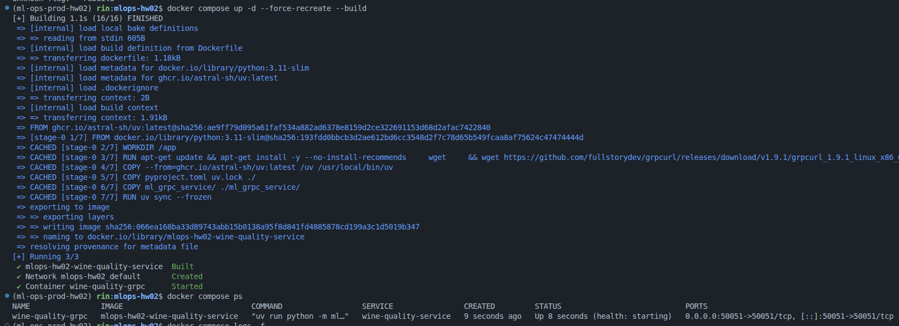
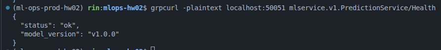
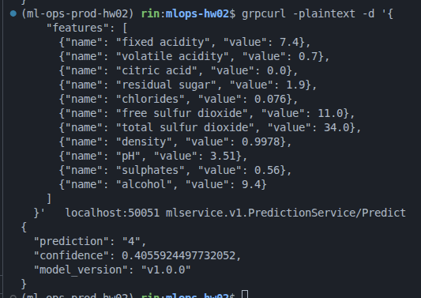

# Домашнее задание 2. ML gRPC Service

gRPC-сервис для предсказания качества вина.
Этот сервис использует модель из ДЗ-1.

## Структура проекта

```
ml_grpc_service/
├── protos/
│   ├── model.proto              # gRPC service definition
│   ├── model_pb2.py             # Generated protobuf code
│   └── model_pb2_grpc.py        # Generated gRPC code
├── server/
│   ├── server.py                # Сервер gRPC
│   ├── inference.py             # Инференс модели
│   └── validation.py            # Валидация признаков качества вина
├── client/
│   └── client.py                # Клиент gRPC для тестирования
└── models/
    ├── wine_quality_model.pkl   # Модель качества вина
    ├── wine_scaler.pkl          # Нормализатор признаков
```

## Wine Quality Features

Модель использует 11 признаков:

1. `fixed acidity`: Кислотность неподвижных кислот
2. `volatile acidity`: Кислотность летучих кислот
3. `citric acid`: Кислотность цитриковой кислоты
4. `residual sugar`: Остаточный сахар после ферментации
5. `chlorides`: Хлориды
6. `free sulfur dioxide`: Свободный диоксид серы
7. `total sulfur dioxide`: Общий диоксид серы
8. `density`: Плотность вина
9. `pH`: Кислотность
10. `sulphates`: Сульфаты
11. `alcohol`: Алкоголь (%)

## Зависимости

Проект использует:
- Python 3.11+
- Пакетный менеджер uv
- Также зависимости указаны в [requirements.txt](requirements.txt)

## Запуск

### Используя docker-compose

```bash
docker-compose up -d
```



#### Примеры вызовов /health и /predict

Проверка health:



Проверка predict:




### Локальный запуск для разработки

Установка зависимостей:

```bash
uv install
```

или pip:

```bash
pip install -r requirements.txt
```

1. Запустить сервер:

```bash
export MODEL_PATH=ml_grpc_service/models/wine_quality_model.pkl
export SCALER_PATH=ml_grpc_service/models/wine_scaler.pkl
export MODEL_VERSION=v1.0.0
export PORT=50051

uv run python -m ml_grpc_service.server.server
```

2. Тестирование клиентом:

```bash
uv run python -m ml_grpc_service.client.client
```

Пример вывода:

```text
(ml-ops-prod-hw02) rin:mlops-hw02$ uv run python -m ml_grpc_service.client.client
Health: ok version: v1.0.0
Wine Quality Prediction: 4 confidence: 0.4056 version: v1.0.0
```

Docker:

```bash
docker build -t grpc-ml-service .
```

```bash
docker run -p 50051:50051 grpc-ml-service
```


## Переменные окружения

| Variable | Description | Default |
|----------|-------------|---------|
| `MODEL_PATH` | Путь к файлу с моделью | `ml_grpc_service/models/wine_quality_model.pkl` |
| `SCALER_PATH` | Путь к файлу с нормализатором | `ml_grpc_service/models/wine_scaler.pkl` |
| `MODEL_VERSION` | Версия модели | `v1.0.0` |
| `PORT` | Порт для gRPC сервера | `50051` |
| `MAX_WORKERS` | Размер пула потоков | `4` |
